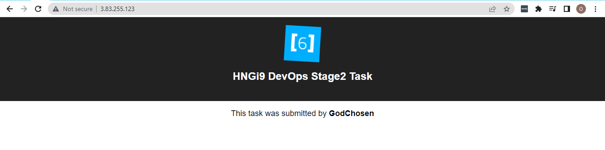

# HNGI9 STAGE 2 PROJECT - DOCKERIZE A PYTHON/DJANGO (BACKEND) AND JAVASCRIPT/REACTJS 9FRONTEND) APPLICATION

### Application Endpoint (Server IP) 
[Public IP](http://3.83.255.123/) OR
[Public IP DNS](ec2-3-83-255-123.compute-1.amazonaws.com)

### Docker Images
1. [Frontend](https://hub.docker.com/repository/docker/godchosen/hngi9-javascript-react-app)

2. [Backend](https://hub.docker.com/repository/docker/godchosen/hngi9-python-django-app)

**Dockerized Application**
 