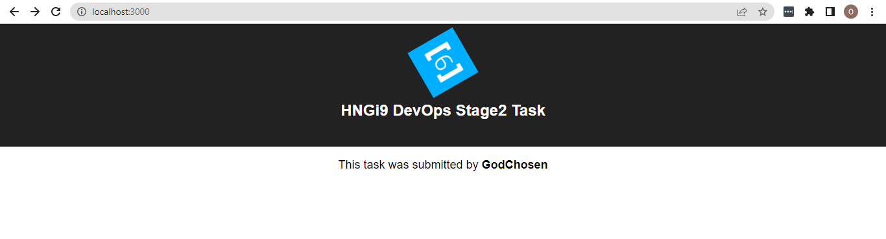
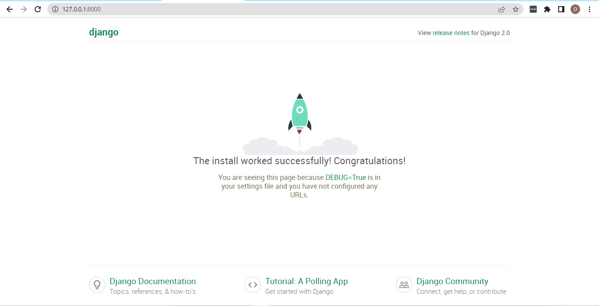

# DOCKERIZE AN APPLICATION
To dockerize the application, below are the  steps I would be following:
1. Fork the repo and clone it locally
2. Customize the app to display my Slack username and test the application
3. Create dockerFile for both the backend and frontend
4. Build images of the backend and frontend using the DockerFiles created and save the images my docker repository
5. Create a docker-compose file that can be used to spin up images (using the command `docker-compose up`) into containers that are connected with one another
6. Use reverse proxy with NGINX to point port 3000 to my server IP
<br />
Note that if successful, the server would run on port 3000 of my server ip - http://<my-server-ip>:3000

### Background information
- The frontend uses JavaScript and React
- The backend uses Python and Django
- I have initially created an EC2 instance on AWS, configure NGINX server on it, created firewall rules to allow SSH access on port 22 and HTTP access on Port 80. So, it would be serving as my server in this project.

##  Fork the repo and clone he application repo locally
- I visited the app repo [here](https://github.com/ibitolamayowa/devops-django-react-task.git) and used the `Fork` button to clone it to my GitHub account.
- Then I copied the repo link and used the following command to clone it to my local PC: `git clone <my-forked-repo-link> `
- I then changed to the repo directory to confirm that all fies are present

## Customize the app and test it
- Per the task requirement, I customized the app to display my slack username. Here are the steps below:
```
# change to the relative path `frontend/src/components`
cd frontend/src/components

# open the `App.js` file and change the name in the line below to my slack username and save the file
<p className="App-intro">
    This task was submitted by <b>GodChosen</b>
</p>
```

- To test the frontend, I used the following code:
```
# navigate to the frontend directory
cd frontend

# install required dependencies
npm i

# start the frontend
npm start
```

***Customized Frontend***


- To test the backend, I used the following code:
```
# create a virtual environment `.venv` and activate it
python -m venv .venv
source .venv/bin/activate

# navigate to the backend directory `api`
cd api

# install required dependencies
pip install -r requirements.txt

# start the server
python manage.py runserver
```

***Working Backend Server***



## Create Dockerfiles for backend and frontend
### Backend
- Create Dockerfile
```
# change to the backend directory `api`
cd api

# create a Dockerfile 
touch Dockerfile
```

- Copy the commands below and paste into the Dockerfile
```
# We Use an official Python runtime as a parent image
FROM python:3.8

# Allows docker to cache installed dependencies between builds
COPY requirements.txt requirements.txt
RUN pip install --no-cache-dir -r requirements.txt

# Mounts the application code to the image
COPY . code
WORKDIR /code

EXPOSE 8000

# runs the production server
ENTRYPOINT ["python", "manage.py"]
CMD ["runserver", "0.0.0.0:8000"]
```

- Buia container image
```
docker build -t godchosen/hngi9-python-django-app:v1 .
```

- Run the container image
```
docker run -it -p 8000:8000 python-django-app
```

- open a firefox browser and visit http://localhost:8000
If everything is done well, the we should be able to see the image below:

***Working Backend***


- Save the backend docker image on Docker hub
```
# login to dockerhub
docker login -u <my-username>       # enter password (dockerhub access token) when prompted

# push image to dockerhub
docker push godchosen/hngi9-python-django-app:v1

```

### Frontend
- Create Dockerfile
```
# change to the frontend directory `frontend`
cd frontend

# create a Dockerfile 
touch Dockerfile
```

- Copy the commands below and paste into the Dockerfile
```
# Dockerfile

# We use the latest version of the base image
FROM node:18.12.0


# Mounts the application code to the image
WORKDIR /app
COPY package.json ./


# runs the production server
RUN cache verify
RUN npm i
COPY . .
CMD ["npm", "start"]
```

- Build container image
```
docker build -t godchosen/hngi9-javascript-react-app:v1 .
```

- Run the container image
```
docker run -it -p 3000:3000 godchosen/hngi9-javascript-react-app:v1
```

- open a firefox browser and visit http://localhost:3000
If everything is done well, the we should be able to see the image below:

***Working Frontend***


- Save the frontend docker image on Docker hub
```
# push image to dockerhub
docker push godchosen/hngi9-javascript-react-app:v1 
```

